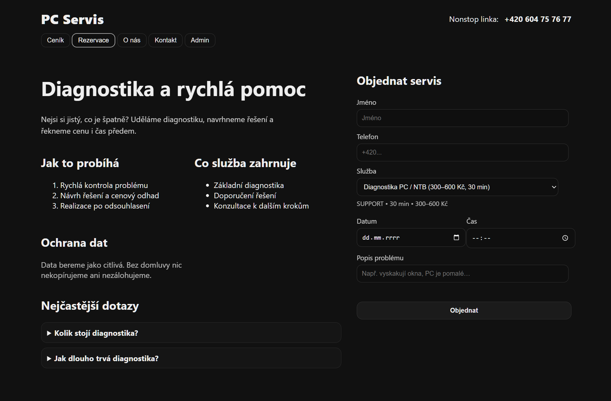
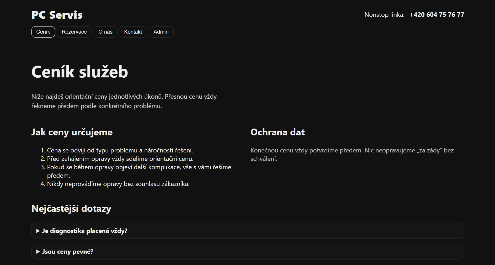
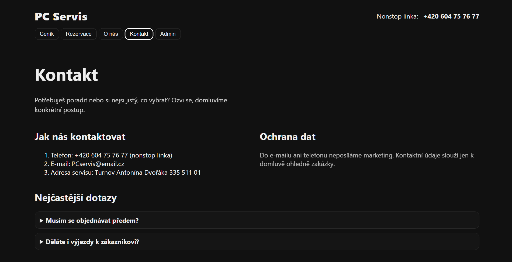

# Rezervační systém – Booking System (Spring Boot + Vite)

Fullstack webová aplikace pro správu rezervací servisních zásahů.
Zákazníci si mohou rezervovat termín, administrátor spravuje rezervace a služby.

---

## Funkce

### Zákazník
- Výběr služby z ceníku
- Rezervace termínu s validací (nelze rezervovat minulost, obsazený termín)
- Vyplnění kontaktních údajů a popisu problému

### Administrátor
- Přehled všech rezervací
- Úprava a mazání rezervací
- Správa nabízených služeb

### Backend
- REST API s vrstvená architekturou
- Validace vstupních dat
- Globální zpracování výjimek
- Kontrola duplicitních termínů
- H2 in-memory databáze


## Ukázky obrazovek

### Rezervace – výběr služby


### Rezervace – karta


### Rezervace – hlavní stránka


### Rezervace – instalace Windows


### Rezervace – výměna disku


### Rezervace – odvirování


### Rezervace – záloha dat


### Rezervace – Q&A


### Ceník


### O nás


### Kontakt


### Admin – přihlášení


### Admin – přehled rezervací


### Admin – úprava rezervace


### Admin – smazání rezervace


### Admin – validační chybová zpráva


---

## Použité technologie

**Backend:** Java, Spring Boot, Spring Data JPA, Hibernate, H2, Maven

**Frontend:** JavaScript, Vite, CSS

---

## Spuštění projektu

### Backend
1. Otevři složku `backend` v IntelliJ IDEA
2. Spusť třídu `ReservationApplication`
3. Backend běží na `http://localhost:8080`

### Frontend
1. Otevři terminál ve složce `frontend`
2. Zadej `npm install`
3. Zadej `npm run dev`
4. Aplikace běží na `http://localhost:5173`

---

## Testy

Projekt obsahuje unit testy pro servisní vrstvu (`ReservationServiceTest`).

Spuštění testů:
```
.\mvnw test
```

Testované scénáře:
- Vytvoření rezervace
- Validace chybějícího data/času
- Zamítnutí rezervace v minulosti
- Zamítnutí obsazeného termínu
- Smazání neexistující rezervace
- Úspěšné smazání rezervace
